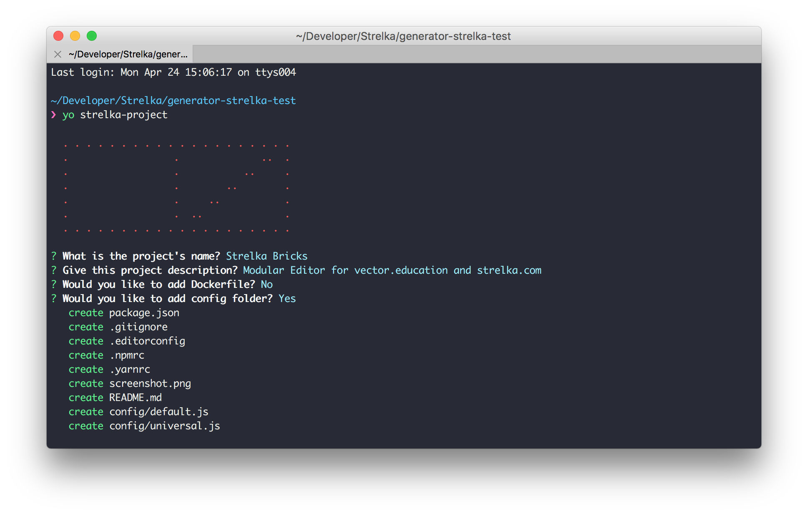

# Yeoman Generator for <br> Strelka Projects

## Quick Start

First, install [Yeoman](http://yeoman.io) and `generator-strelka-project` with [npm](https://www.npmjs.com/)

```bash
$ npm install -g yo
$ npm install -g generator-strelka-project
```


Then generate your new project:

```bash
$ mkdir name-of-new-project && cd name-of-new-project
$ yo strelka-project
```


This will setup new git repository with `README`, `package.json` and `eslint-config-strelka`, + other required files like `.editorconfig`, `.gitignore`, etc..


---
Strelka
