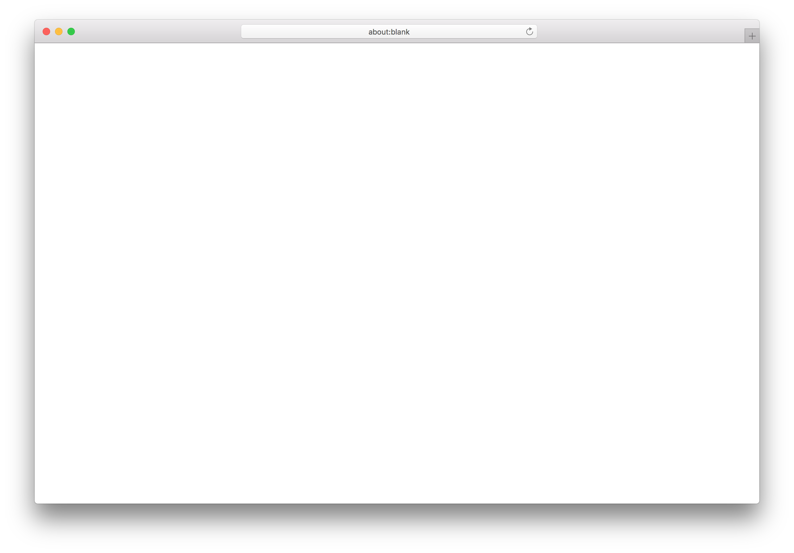

# <%= projectName %>

> <%= projectDescription %> 


## Requirements

- [Node.js](https://nodejs.org/en/)
- [Yarn](https://yarnpkg.com/en/docs/install) package manager


## Quick Start

```sh
$ yarn # or npm install
$ yarn run dev # or npm run dev
$ open http://0.0.0.0:3000
```


## Build & Deploy

> TODO: Steps required to deploy application


### Setup

> TODO: Configuration files and env variables


## Related

- [eslint-config-strelka](https://github.com/strelka-institute/eslint-config-strelka) - Strelka's eslint config

---
Strelka
